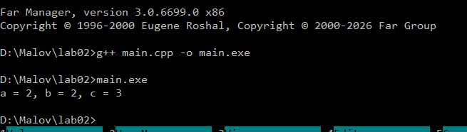

# Отчет по работе 2

## Задание 1. Ключевые слова

Задание 1. Ключевые слова синтаксиса

Примеры ключевых слов (по 5 для каждого языка):
1. C++: if, while, return, class, int
2. Java: public, static, void, new, extends
3. Python: def, import, lambda, True, pass

Ответ:
Создавать переменные с именами ключевых слов нельзя ни в одном из этих языков. 
Ключевые слова являются фиксированными символьными последовательностями, зарезервированными компилятором или интерпретатором, и имеют строго определенное значение для синтаксического разбора языка. Попытка создать переменную с таким именем (например, int if = 5; в C++ или class = 10 в Python) приведет к синтаксической ошибке на этапе лексического или синтаксического анализа (транслятор выдаст ошибку компиляции или SyntaxError и прервет работу).

## Задание 2. Разбиение на токены

Задание 2. Разбор программ на токены и анализ ошибок

1. Программа на C++:
Код: 
int a = 1, b = 2;
int c = a++b;

Последовательность токенов для второй строки: 
[int] [c] [=] [a] [++] [b] [;]

Причина синтаксической ошибки в C++:
Токенизатор C++ работает по принципу конечного автомата и использует правило «максимальной заглатываемости» (Maximal Munch). Читая символы слева направо, он группирует их в максимально длинный возможный токен. Встретив два плюса подряд, он гарантированно объединяет их в один токен постфиксного инкремента [++]. Идущий следом символ «b» распознается как идентификатор. В грамматике C++ конструкция вида «идентификатор [++] идентификатор» (то есть (a++) b) является синтаксически ошибочной, так как между ними отсутствует бинарный оператор (например, сложения). Транслятор не может построить дерево разбора и прерывает компиляцию.

2. Программа на Python:
Код:
a = 1
b = 2
c = a++b

Последовательность токенов для третьей строки:
[c] [=] [a] [+] [+] [b]

Почему в Python нет ошибки:
В языке Python полностью отсутствует оператор инкремента (знак «++» не существует как единый токен). Поэтому токенизатор Python считывает эти символы как два абсолютно раздельных токена унарных/бинарных операторов плюс. Конструкция успешно разбирается как c = a + (+b), где первый плюс — это бинарное сложение, а второй — унарный плюс переменной b (который не меняет её знак). Математически это эквивалентно стандартному выражению a + b, поэтому программа работает корректно.
.
## Задание 3. Три плюса подряд
Отчет по Заданию 3:
После исполнения программы значения переменных равны: a = 2, b = 2, c = 3.Разбиение на токены: 
int | a | = | 1 | , | b | = | 2 | ; | int | c | = | a | ++ | + | b | ;
Объяснение работы:Согласно правилу «максимальной заглатываемости» (Maximal Munch), токенизатор C++ читает символы слева направо и пытается собрать максимально длинный токен. 
В выражении a+++b он сначала видит первый плюс, затем второй и объединяет их в один токен постфиксного инкремента — ++. 
Третий плюс считывается как отдельный токен бинарного сложения.Таким образом, выражение разбирается компилятором как (a++) + b. 
Сначала вычисляется сумма 1 + 2, результат 3 присваивается переменной c. После этого срабатывает постфиксный инкремент переменной a, и её значение увеличивается до 2. 
Переменная b не меняется.Можно ли изменить разбиение пробелами?Да, можно. Если вставить пробел вот так: a + ++ b, то токенизатор будет разделять их пробельным символом как границей токенов. 
Выражение превратится в a + (++b). В этом случае сначала выполнится префиксный инкремент b (она станет равна 3), а затем сложение 1 + 3. Результат c станет равен 4.

##Задание 4. Круглые и квадратные скобки как операторы

1. Квадратные скобки [] являются оператором, когда используются для:
   - Индексации (доступа к элементам массивов, строк, списков или словарей).
   - Пример: array[0] или list[i].
   В остальных случаях они оператором не являются (например, при объявлении массива "int arr[5];" в C++ это пунктуатор, задающий размер, а в Python "x =" — это синтаксис создания литерала списка).

2. Круглые скобки () являются оператором, когда выполняют роль:
   - Оператора вызова функции или метода (помещаются строго после идентификатора функции).
   - Пример: abs(x), input(), print(i).

Круглые скобки НЕ являются оператором, когда используются для:
   - Изменения приоритета математических или логических операций: "(a < b)" или "(z - 1)".
   - Оформления синтаксических конструкций в управляющих инструкциях: "while (x < 10)" или "if (condition)".

## Задание 5. Программа на Python

Задание 5. Анализ программы на Python

Исходный код:
print(*map(sum, zip(*[map(int, input().split()) for i in (1, 2, 3)])))

1. Классификация токенов в фрагменте:
   - Ключевые слова: for, in.
   - Идентификаторы (функции/методы): print, map, sum, zip, int, input, split.
   - Идентификаторы (переменные): i.
   - Литералы: 1, 2, 3 (целочисленные литералы).
   - Операторы: * (оператор распаковки аргументов), круглые скобки после имен функций (операторы вызова функций).

2. Перечень вызываемых функций и их параметры:
   - input() — вызывается 3 раза. Параметров не принимает. Возвращает считанную из стандартного ввода строку.
   - split() — вызывается 3 раза как метод строкового объекта, возвращенного input(). Без параметров разделяет строку по пробелам на список подстрок.
   - map(int, ...) — вызывается 3 раза внутри генератора списков. Параметры: тип int (функция приведения) и список строк от split(). Переводит строки в целые числа.
   - zip(*[...]) — вызывается 1 раз. Принимает распакованный список (3 объекта-итератора map). Объединяет элементы с одинаковыми индексами в кортежи.
   - map(sum, ...) — вызывается 1 раз. Параметры: функция sum и объект zip. Применяет sum к каждому сгенерированному zip-кортежу.
   - print(...) — вызывается 1 раз. Принимает распакованные результаты работы верхнего map и выводит их через пробел.

3. Что делает программа и как приходит к результату:
   Программа считывает из консоли матрицу чисел размером 3 строки (за это отвечает цикл for i in (1, 2, 3)) и находит сумму чисел в каждом СТОЛБЦЕ, выводя результаты в одну строку через пробел.
   
   Алгоритм работы:
   1) Списковое включение [map(...) for i in (1,2,3)] трижды запрашивает ввод, разбивает строки по пробелам и превращает их в списки чисел. Получается список из 3-х строк (матрица).
   2) Оператор звёздочки "*" перед списком распаковывает его, передавая в zip() три отдельные строки как три независимых аргумента.
   3) Функция zip() транспонирует матрицу: она берет первые элементы всех трех строк и группирует их вместе (это первый столбец), затем вторые элементы (второй столбец) и т.д.
   4) Внешний map(sum, ...) пробегается по этим столбцам и считает сумму чисел в каждом из них.
   5) print(*...) распаковывает полученные суммы и выводит их на экран.

## Задание 6. Комментарии

Разбор пяти приведенных примеров:

1. СЛУЧАЙ С ОШИБКОЙ:
Код: cout < <" Hello /* Это комментарий */ world ";
Анализ: Ошибка здесь НЕ в комментарии. Ошибка в операторе вывода: между угловыми стрелками стоит пробел "< <". Токенизатор распознает это как два отдельных оператора "меньше", что вызовет синтаксическую ошибку (должно быть строго "<<"). Текст внутри кавычек является строковым литералом, поэтому /* ... */ там воспринимается просто как обычный текст, а не комментарий.

2. СИНТАКСИЧЕСКИ ВЕРНЫЙ:
Код:
// /*
Это комментарий
*/
Анализ: Первая строка начинается с однострочного комментария "//", поэтому символы "/*" полностью игнорируются компилятором. Однако строки "Это комментарий" и "*/" не закомментированы! Компилятор попытается скомпилировать слова "Это" и "комментарий" как код, что вызовет ошибку. (Пример верный с точки зрения синтаксиса комментариев, но код не скомпилируется).

3. СЛУЧАЙ С ОШИБКОЙ (Классическая ловушка лекции):
Код: /* Я комментирую программы /* комментарий */ */
Анализ: В C++ МНОГОСТРОЧНЫЕ КОММЕНТАРИИ НЕ МОГУТ БЫТЬ ВЛОЖЕННЫМИ. Токенизатор, увидев первое открытие "/*", ищет ближайшее закрытие "*/". Он закроет комментарий сразу после слова "комментарий". Оставшийся в конце символ "*/" окажется вне комментария, компилятор не поймет, что это, и выдаст синтаксическую ошибку.

4. СИНТАКСИЧЕСКИ ВЕРНЫЙ:
Код: // Я комментирую программы /* комментарий */
Анализ: Строка начинается с однострочного комментария "//". Всё, что идет после него до конца строки (включая символы /* и */), полностью игнорируется токенизатором. Ошибок нет.

5. СЛУЧАЙ С ОШИБКОЙ:
Код:
/* Я комментирую свои программы
// Это комментарий до конца строки */
*/
Анализ: Многострочный комментарий открывается на первой строке "/*" и успешно закрывается в конце второй строки "*/". Идущий следом на третьей строке одинокий символ "*/" оказывается синтаксическим мусором и вызывает ошибку компиляции.

## Задание 7. Циклы в стандарте C++

Как видно из формальных правил стандарта C++ (приложение A.5), в языке существует 4 инструкции циклов (iteration-statement).

1. Цикл с предусловием (while)
Строка правила: while ( condition ) statement
Описание: Состоит из ключевого слова «while», за которым в круглых скобках следует управляющее условие «condition», а затем исполняемая инструкция или блок инструкций «statement». Условие проверяется ДО выполнения тела цикла.
Пример кода:
int x = 1;
while (x < 5) {
    x++;
}

2. Цикл с постусловием (do-while)
Строка правила: do statement while ( expression ) ;
Описание: Состоит из ключевого слова «do», тела цикла «statement», за которым идет ключевое слово «while», в круглых скобках вычисляемое выражение «expression» и обязательный символ точки с запятой «;». Тело цикла гарантированно выполняется хотя бы один раз, так как проверка условия происходит ПОСЛЕ итерации.
Пример кода:
int y = 0;
do {
    y++;
} while (y < 5);

3. Классический цикл с инициализацией (for)
Строка правила: for ( init-statement condition_opt ; expression_opt ) statement
Описание: Состоит из ключевого слова «for», за которым в круглых скобках через точку с запятой идут три элемента: необязательное выражение инициализации «init-statement», необязательное условие выхода «condition_opt» и необязательное выражение инкремента/изменения «expression_opt». За ними следует тело цикла «statement».
Пример кода:
for (int i = 0; i < 10; i++) {
    int v = i * 2;
}

4. Диапазонный цикл (range-based for)
Строка правила: for ( for-range-declaration : for-range-initializer ) statement
Описание: Состоит из ключевого слова «for», внутри круглых скобок объявляется переменная цикла «for-range-declaration», затем ставится разделитель двоеточие «:», указывается коллекция или контейнер «for-range-initializer», по которому идет перебор, и далее идет тело цикла «statement». Используется для удобного перебора массивов и контейнеров.
Пример кода:
int arr[] = {1, 2, 3};
for (int num : arr) {
    int res = num;
}

## Задание 8. Синтаксическое дерево

Задание 8. Абстрактное синтаксическое дерево (AST)

Выражение: a = -x + y * (z - 1);

Иерархическая структура дерева (сверху вниз по приоритетам операций):
[=] (Оператор присваивания — корень дерева)
 |-- [Идентификатор: a] (Левый операнд)
 |-- [+] (Оператор сложения)
      |-- [-] (Унарный минус)

      |    |-- [Идентификатор: x]
      |-- [*] (Оператор умножения)
           |-- [Идентификатор: y]
           |-- [-] (Бинарный минус, скобки удаляются как синтаксический мусор)
                |-- [Идентификатор: z]
                |-- [Литерал: 1]

При построении абстрактного синтаксического дерева удаляются все токены, не влияющие на исполняемый код (в данном случае круглые скобки вокруг "z - 1" и точка с запятой ";").
Узлами дерева становятся операторы, а листьями — идентификаторы переменных и литералы. Порядок выполнения операций определяется высотой узла: чем ниже узел, тем выше приоритет операции. 
Бинарный минус [z - 1] находится на самом нижнем уровне, так как скобки требовали его первоочередного вычисления.
